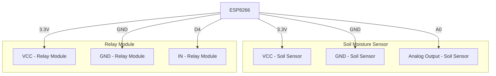

# ESP8266 PlantWatering System

## How It Works
The ESP8266 PlantWatering System uses an ESP8266 microcontroller to monitor soil moisture levels and control a relay to water plants automatically. The system reads the soil moisture value from a sensor and compares it to a predefined threshold. If the soil moisture is below the threshold, the relay is activated to water the plants.

## Installation
1. Clone this repository to your local machine.
2. Open the Arduino IDE and install the necessary libraries: `ESP8266WiFi`, `ESP8266WebServer`, `WebSocketsServer`, `Ticker`, and `FS`.
3. Connect the soil moisture sensor to the ESP8266 as follows:
   - VCC to 3.3V
   - GND to GND
   - Analog output to A0
4. Connect the relay module to the ESP8266 as follows:
   - VCC to 3.3V
   - GND to GND
   - IN to D4
5. Open the appropriate `.ino` file for the variant you want to use (`IrrigationSystemWithWebserver` or `IrrigationSystemBasic`) in the Arduino IDE.
6. Update the WiFi credentials in the code.
7. Adjust the soil moisture sensor values to match the needs of your plant by editing the following variables in the code:
   - `maxSoilMoistValue`: The value representing the maximum soil moisture (wet).
   - `minSoilMoistValue`: The value representing the minimum soil moisture (dry).
   - `plantmoistureThresholdPercentage`: The threshold percentage below which the relay will be activated to water the plant.
8. Upload the code to the ESP8266.

### additionally
9. For the web server variant, upload the `index.html` file to the `web` directory in SPIFFS using the Arduino IDE or another tool.
10. Open the Serial Monitor to view the IP address assigned to the ESP8266.
11. For the web server variant, open a web browser and navigate to the IP address to view the soil moisture data.

## Required Components
- ESP8266 microcontroller
- USB cable for the ESP8266
- Soil moisture sensor
- Relay module
- Small 3V/5V water pump
- Tubing for the water pump
- Connecting wires

## Variants
### IrrigationSystemWithWebserver
This variant includes a web server and WebSocket functionality to display real-time soil moisture data on a web page. It uses Chart.js to plot the data and allows remote monitoring of the soil moisture levels.

### IrrigationSystemBasic
This variant is a simpler version that only reads the soil moisture sensor and controls the relay based on the moisture level. It does not include any web server or remote monitoring capabilities.

## Contribution
Contributions to this repository are welcome! If you have additional ideas or improvements, feel free to submit pull requests.

## License
This repository is licensed under the [MIT License](./LICENSE).